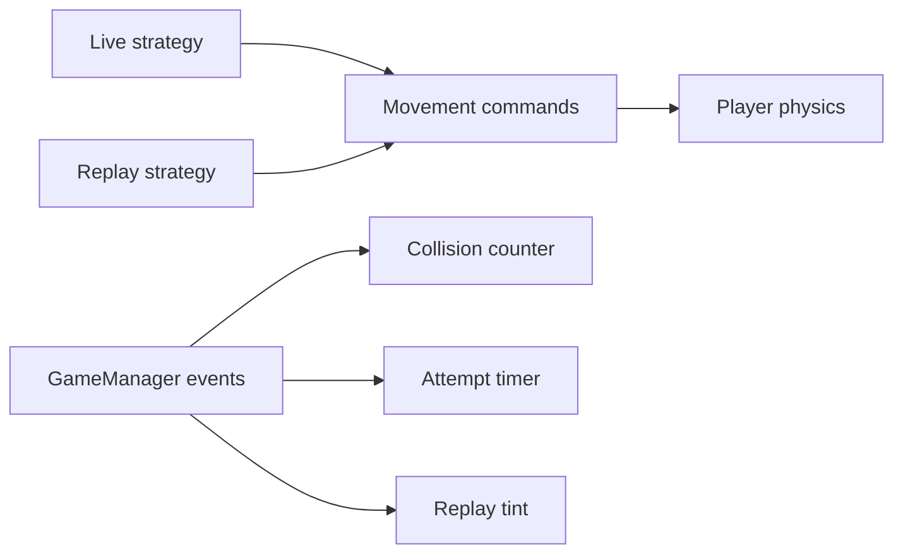

# Cubethon

A small Unity obstacle-dodging game **based on Brackeys' "How to make a Video Game" series**, expanded with replays, design patterns, and a few quality-of-life features.

**[Play here](https://ronno7.github.io/Cubethon/)**

Dodge obstacles, stay on the road, and finish all three levels. The tutorial provided the movement, camera, scoring, and menu/level foundation.

## What was added

| Feature | How it was built |
| --- | --- |
| Replay your attempt | **Command pattern:** record steering commands, reset the player, then execute them again. |
| Switch between playing and replaying | **Strategy pattern:** live input and recorded input supply commands through the same interface. |
| Collision counter, attempt timer, blue replay tint | **Observer pattern:** separate components react to game events; observers are attached automatically. |
| Win/loss panel | Freeze the player and score, then let you replay, retry, or advance after a win. |
| Input and platform support | Support both Unity input backends, check scene availability, and handle quitting appropriately for desktop, browser, and Editor. |

Replays stay in memory until you leave or restart the level. They preserve the original result without adding crashes or changing the attempt time.

## Controls

| Move | Replay after finishing | Retry | Menu | Next level after a win |
| --- | --- | --- | --- | --- |
| A/D or arrow keys | V | R | Esc | Enter |

Browse the implementation in [`Assets/Scripts`](Cubethon/Assets/Scripts). The browser demo reflects the last exported WebGL build.
